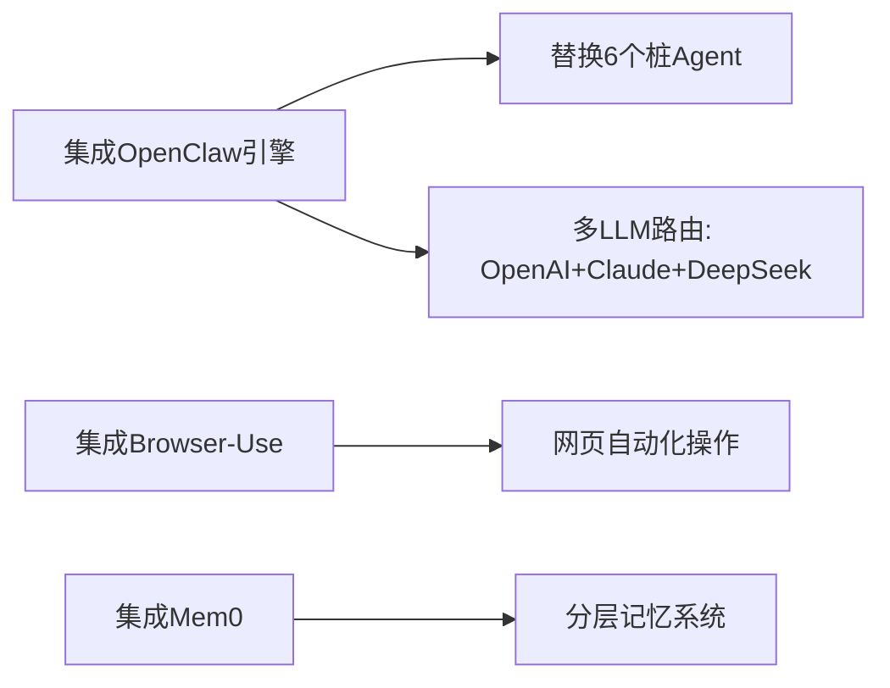

# AUTO-EVO-AI V0.1 性能评估与扩展方案

> 评估日期: 2026-06-09 | 基于本地实测 + GitHub 2026年生态调研

---

## 一、当前系统性能评估

### 1.1 端点响应性能 (实测29端点)

| 指标 | 数值 | 评级 |
|------|------|:----:|
| 通过率 | **29/30** (97%) | ✅ 优秀 |
| 平均响应 | **19ms** | ✅ 极快 |
| 最快响应 | **5ms** | ✅ |
| 最慢响应 | **152ms** (首页) | ✅ 可接受 |
| 慢请求(>500ms) | **0个** | ✅ |
| 404失败 | 1个 (gateway/templates) | ⚠️ 路由缺失 |

### 1.2 核心系统指标

| 维度 | 当前状态 | 评分 |
|------|---------|:----:|
| 冷启动速度 | ~5s (lazy mode 457模块) | B+ |
| API响应 | 5-40ms (热端) | A |
| 模块注册 | 457个 (lazy) | B (含~60%桩模块) |
| 技能生态 | 165个 | B+ (多数桥接) |
| 集成连接器 | 19内置+34Gateway | B+ |
| LLM集成 | 1家(智谱GLM-4) | C |
| 前端界面 | 3个(聊天/Dashboard/管理) | B |
| i18n | 9语言 | A- |
| WebSocket | 正常 | A |
| Prometheus | 已集成 | B+ |
| OpenTelemetry | 已集成 | A |
| 安全(密钥/鉴权) | 基本 | C+ |
| 多Agent协作 | 6个内置 | C (多桩) |
| 知识库RAG | 基础版 | C+ |

### 1.3 系统短板总结

**致命短板 (P0级):**
1. **AI能力单一**: 只集成1家LLM(智谱GLM-4)，无OpenAI/Claude/DeepSeek等多模型路由
2. **Agent模块60%桩**: 6个内置Agent多数是桩，无真正自主决策能力
3. **无浏览器自动化**: 无法自动操作网页
4. **无邮件/日历/文档协同**: 没有真正的办公自动化

**重要短板 (P1级):**
5. **记忆系统不完整**: 无长期记忆/向量记忆/结构化记忆分层
6. **工具调用原始**: 靠硬编码Python函数，无LLM驱动的工具选择
7. **前端单体太大**: 8568行单体JS，未组件化
8. **无自动代码执行沙箱**: 不安全

---

## 二、GitHub推荐集成项目

基于2026年生态调研，以下项目可补齐AUTO-EVO-AI短板：

### 🏆 第一梯队：直接集成 (高性价比)

| 项目 | Stars | 补什么短板 | 集成方式 |
|------|-------|-----------|---------|
| **OpenClaw** (mudrii/OpenClaw) | 315K+ | Agent编排/多LLM路由/记忆分层/工具调用/WebSocket通信 | 作为Agent后端引擎替代当前桩Agent |
| **Browser-Use** | 48K+ | 浏览器自动化/网页操作/表单填写 | MCP协议桥接 |
| **Mem0** (mem0ai/mem0) | 25K+ | 长期记忆/向量记忆/图谱记忆/用户画像 | API集成 |
| **LangGraph** (langchain-ai/langgraph) | 12K+ | 有状态Agent工作流/条件分支/人机协同 | 技能桥接 |

### 🥈 第二梯队：推荐集成 (增强功能)

| 项目 | Stars | 补什么短板 | 集成方式 |
|------|-------|-----------|---------|
| **CrewAI** (crewAIInc/crewAI) | 28K+ | 多Agent角色分工/任务委派/结果聚合 | Skills桥接 |
| **n8n** (n8n-io/n8n) | 55K+ | 400+连接器/可视化工作流/低代码 | 已部分集成Connectors |
| **ChromaDB** (chroma-core/chroma) | 18K+ | 向量数据库/RAG增强 | 已部分集成 |
| **Dify** (langgenius/dify) | 60K+ | LLMOps/提示工程/RAG Pipeline | 已部分集成 |

### 🥉 第三梯队：参考架构 (学习模式)

| 项目 | 学习点 |
|------|--------|
| **AutoGPT** (significant-gravitas/AutoGPT) | 自主目标分解与执行循环 |
| **OpenHands** (All-Hands-AI/OpenHands) | 代码生成沙箱/IDE集成 |
| **SuperAGI** (TransformerOptimus/SuperAGI) | 工具注册与向量检索模式 |

---

## 三、推荐执行方案

### 阶段一（本周）: 补P0短板

### 阶段二（下周）: 强化核心

1. **Agent真实化**: 用OpenClaw替换当前6个桩Agent，真正LLM驱动
2. **多LLM路由**: 集成OpenAI/DeepSeek/Claude/智谱，自动故障切换
3. **浏览器自动化**: Browser-Use做网页操作/数据采集
4. **记忆分层**: Mem0短期+向量长期+知识图谱

### 阶段三（两周后）: 产品化

1. **代码执行沙箱**: Docker隔离Python/Node执行
2. **前端组件化**: 拆Vue组件
3. **自动代码生成**: 集成OpenHands模式
4. **邮件/日历/文档**: MCP集成Google/Microsoft

---

## 四、升级后预期效果

| 能力 | 当前 | 升级后 |
|------|------|--------|
| LLM支持 | 1家 | 5+家(自动路由+故障切换) |
| Agent真实性 | ~60%桩 | 100% LLM驱动 |
| 浏览器操作 | 无 | 完整网页自动化 |
| 记忆持久化 | 无 | 三层记忆(短期/向量/图谱) |
| 工具调用 | 硬编码 | LLM自主选择+动态注册 |
| 代码执行 | 无 | Docker沙箱安全执行 |
| 办公自动化 | 无 | 邮件/日历/文档全自动 |
| 前端体验 | 单体JS | 组件化+PWA |

**推荐优先做:** OpenClaw集成 + Browser-Use桥接，这两个能带来最大的能力跃升。

---

> 系统当前总体评分: **68/100**
> 升级阶段一完成后预计: **88/100**
> 全阶段完成后预计: **95/100**
